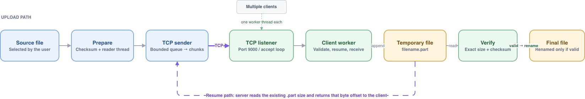

# RapidShare

RapidShare is a small C++17 client-server file transfer project. It sends files over TCP, continues interrupted uploads, verifies file integrity, and handles several clients at the same time.

## Problem It Solves

Transferring a large file over an unreliable connection can be wasteful. A basic file-transfer program often has to restart from the beginning if the connection drops, may save a corrupted or incomplete file without detecting it, and may block other users while one upload is running.

RapidShare addresses these problems by:

- continuing an interrupted upload from the last byte stored by the server
- checking the completed file before accepting it
- serving multiple clients concurrently
- displaying upload progress and transfer speed
- writing incomplete uploads to temporary `.part` files so they are not mistaken for completed files

## What It Does

The client calculates a checksum, connects to the server over TCP, and sends the file metadata. The server checks whether a partial upload already exists and returns the byte position from which the client should continue. A background reader loads file chunks into a bounded queue while the client's main thread sends them over the network.

After receiving all chunks, the server verifies the final size and checksum. Only a valid file is renamed from its temporary `.part` name to the requested filename. If the transfer stops early, the partial file remains available for the next attempt.

## System Design



## Why It Is Better Than a Basic File Transfer

Compared with a minimal program that opens a socket and streams a file once, RapidShare provides:

- **Recovery instead of restarting:** interrupted uploads continue from the stored offset, saving time and bandwidth
- **Verified results:** size and checksum validation detect incomplete or accidentally corrupted transfers
- **Safe completion:** partial data stays separate until verification succeeds
- **Concurrent service:** each client is handled by its own worker thread
- **Bounded memory use:** a fixed-capacity producer-consumer queue prevents the client from reading the entire file into memory
- **Portable protocol values:** integers use network byte order, allowing communication between machines with different native byte ordering
- **Operational visibility:** progress percentage and throughput make transfers easier to monitor

RapidShare is intended as a compact systems-programming project rather than a production file-sharing service. A public deployment would additionally require authentication, transport encryption, storage quotas, rate limiting, and stronger security controls.

## Features

- TCP file uploads
- resumable partial transfers
- FNV-1a 64-bit integrity check
- background file reader with a bounded thread-safe queue
- one server worker thread per client
- configurable transfer chunk size
- progress and throughput display
- filename sanitization
- no third-party dependencies

## Build

Requirements: a C++17 compiler and macOS or Linux.

Using Make:

```bash
make
make test
```

Using CMake 3.16+:

```bash
cmake -S . -B build
cmake --build build
ctest --test-dir build --output-on-failure
```

## Run

Start the server:

```bash
./build/rapidshare_server 9000 received_files
```

Upload a file from another terminal:

```bash
./build/rapidshare_client 127.0.0.1 9000 path/to/file.zip
```

The optional fourth client argument changes the chunk size in KB:

```bash
./build/rapidshare_client 127.0.0.1 9000 path/to/file.zip 512
```

If a connection ends early, run the same client command again. The server keeps the `.part` file and tells the client where to continue.

## Design

The client sends metadata followed by length-prefixed data chunks. A background thread reads the source file into a bounded queue while the main thread sends those chunks. The server starts a detached worker for every connection, so separate clients can upload concurrently.

All integers in the wire protocol use network byte order. After the last chunk, the server calculates the checksum of the received file and only moves it to its final name when the checksum and size match.
